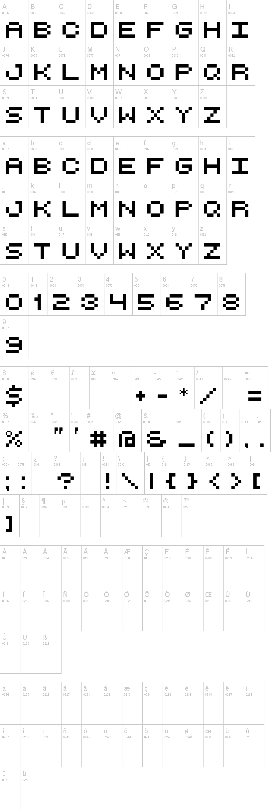

<h1 align="center">
Pixelated image
</h1>

This is an algorithm to create a pixelated image from characters typed by the user.

  

  
  

## Getting started

1. Clone this repo using `git clone git@github.com:Vitorhr10/pixelated-image.git`
2. Move yourself to the appropriate directory: `cd Caracteres`
3. Run `execut the file` and type a word

## License

This project is licensed under the MIT License - see the [LICENSE](https://opensource.org/licenses/MIT) page for details.